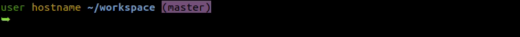

Prmpt [](https://travis-ci.org/ltn100/prmpt) [](https://prmpt.readthedocs.io/en/latest/) [](https://coveralls.io/github/ltn100/prmpt) [](https://pypi.org/project/prmpt/) [](http://opensource.org/licenses/MIT)
=======

Prmpt is a [command prompt](https://en.wikipedia.org/wiki/Command-line_interface#Command_prompt) [markup language](https://en.wikipedia.org/wiki/Markup_language).

The language is loosely modelled on the [LaTeX](https://en.wikipedia.org/wiki/LaTeX) markup language, used for typesetting.

Here is an example of the sort of interactive command prompt that can be built using prmpt:


# Installation

The latest version can be installed from PyPI using `pip`:

```bash
sudo pip install prmpt
```

You then need to insert a line at the end of your `.bashrc` file so that prmpt is called from the `PS1` environment variable:

```bash
prmpt -b >> ~/.bashrc
```

Now re-source your updated `.bashrc` file:

```bash
source ~/.bashrc
```
(alternatively you can restart your shell session)


> **Tip:** If you get an error like "`bash: prmpt: command not found`", it is probably because you installed it locally, as a non-root user (without `sudo`). This is fine, but you will need to call the prmpt executable from its local path:
>
> `~/.local/bin/prmpt -b >> ~/.bashrc`


# Configuration

The configuration for prmpt is defined in your `~/.local/share/prmpt/prmpt.cfg` file:

```cfg
[prompt]
prompt_file = default.prmpt
```

The `prompt_file` variable specifies which prmpt file is currently in use. The prmpt files are located in `~/.local/share/prmpt/`. You can change the configuration to use one of the pre-defined ones, or write your own.


# Examples

## Simple example

You can define a simple `.prmpt` file like this:

```TeX
\green{\user}\space
\yellow{\hostname}\space
\blue[bold]{\workingdir}\space
\magenta[inverted]{(\repobranch )}\newline
\green[bold]{\unichar{0x27a5}}\space
```

And your prompt will end up looking like this:




## A more verbose example

Here is a verbose example with comments to explain the syntax used:

```TeX
% comments are allowed
% and white-space does not matter!

% first the username
\lightblue{\user}

% then an @ symbol
@

% followed by the machine name
\green{\hostname}

% if we want an actual space, we do this:
\space

% now the working directory in a nice yellow.
% lets also make it bold!
\yellow[bold]{\workingdir}
\space

% now for the VCS repository branch
(\repobranch )
\space

% and finally we have the special $ sign
% (which actually turns into a # when you're root)
\dollar\space
```

This prmpt script will achieve the following prompt:


## More

[`elite.prmpt`](./skel/elite.prmpt):


[`red.prmpt`](./skel/red.prmpt):


For a more elaborate example, see [`~/.local/share/prmpt/default.prmpt`](./skel/default.prmpt) (this is the one used for the animation at the top of this page).


# Documentation

Documentation is available at [readthedocs](https://prmpt.readthedocs.io/en/latest/).